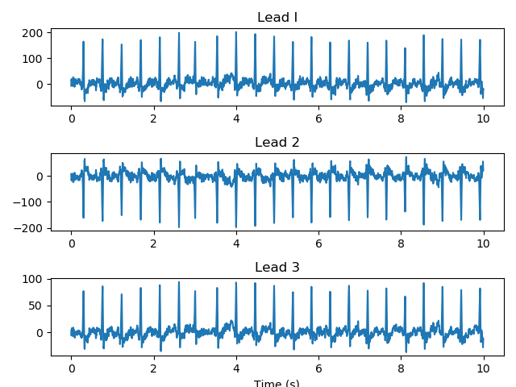

## ECG Interpretation

The `xml_to_ECG.py` file includes a class that reads in an XML file and creates an ECG signal object. Currently, the class has methods that can print random waveforms, including the `plot_random_arrhythmia()` method, which plots rhythms from the data that were labeled as arrhythmic.

---

#### To Run:
You must download your own XML file from the Biobank and add it to the `./data` folder. Next, in `xml_to_ECG.py`, change the following line, so it points to your data file:

```py
ECG_SIGNAL = ECGSignal('./data/ecg_biobank_test.xml')
```

The script will read the XML file, create a class, print all the tags in the XML file and plot a random arrhythmic trace. 

The baseline plot looks like:


